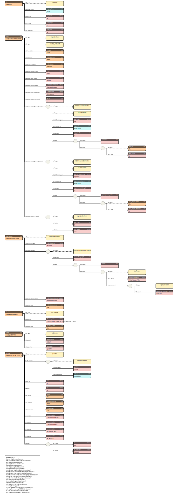

# mgend-rdf

## Usage

```
USAGE:
    mgend-rdf [FLAGS] <input> --assembly <assembly> --directory <directory> --format <format> --hgnc <hgnc>

FLAGS:
    -h, --help         Prints help information
        --rehearsal    Process only one line
    -V, --version      Prints version information

OPTIONS:
        --assembly <assembly>      Assembly [possible values: GRCh37, GRCh38]
        --directory <directory>    Path to output directory
        --format <format>          Output format [possible values: jsonld, turtle]
        --hgnc <hgnc>              Path to hgnc_complete_set.txt (wget
                                   ftp://ftp.ebi.ac.uk/pub/databases/genenames/new/tsv/hgnc_complete_set.txt)

ARGS:
    <input>    Path to input file [*.tsv | *.tsv.gz]
```

1. Obtain `hgnc_complete_set.txt`

   ```
   $ wget ftp://ftp.ebi.ac.uk/pub/databases/genenames/new/tsv/hgnc_complete_set.txt
   ```

1. Run converter

   ```
   $ mgend-rdf --assembly GRCh38 --format turtle --hgnc hgnc_complete_set.txt --directory output MGeND_hg38.tsv.gz
   ```

## Usage (Docker version)
### NOTE
* <b>The data file location used by the container should be placed in `./data/` and accessed in the container by the path `/data/`.</b>
* <b>If you have an old version of the docker engine (`$ docker version` < 1.27.0), install docker-compose and use the `docker-compose` command instead of the `docker compose` command.</b>
### STEPS
1. Build container (at the first time or at the time of source code modification)
```
$ git clone https://github.com/med2rdf/mgend.git
$ cd mgend
$ docker compose build --no-cache
// output help
$ docker compose run --rm rust-app mgend-rdf --help
```

2. Obtain `hgnc_complete_set.txt` and save it in `./data/` directory
```
$ curl -o ./data/hgnc_complete_set.txt https://storage.googleapis.com/public-download-files/hgnc/tsv/tsv/hgnc_complete_set.txt
```
3. Copy input file to `./data/` directory
```
$ cp -a /your/path/MGeND_hg38.tsv.gz ./data/MGeND_hg38.tsv.gz
```
4. Run converter
```
$ docker compose run --rm rust-app mgend-rdf --assembly GRCh38 --format turtle --hgnc /data/hgnc_complete_set.txt --directory /data/output /data/MGeND_hg38.tsv.gz
// check the output files
$ ls ./data/output
mgend_variant.ttl.gz   mgend_case.ttl.gz   mgend_disease.ttl.gz   mgend_gene.ttl.gz  mgend_submission.ttl.gz
```

<b> From this point onward, the instructions describe how to convert files (`ttl` to `nt` format) to remove backslashes from the local part of RDF URIs during loading.  
This step is not necessarily required if you are not using Virtuoso as the database for loading RDF.</b>

5. Extract `.gz` files
```
$ gunzip data/output/*.gz
```

7. Convert from ttl to nt format
```
$ docker compose run --rm raptor rapper -i turtle -o ntriples /data/output/mgend_case.ttl > ./data/output/mgend_case.nt 2> ./data/output/mgend_ttl2nt_convert.log
$ docker compose run --rm raptor rapper -i turtle -o ntriples /data/output/mgend_disease.ttl > ./data/output/mgend_disease.nt 2>> ./data/output/mgend_ttl2nt_convert.log
$ docker compose run --rm raptor rapper -i turtle -o ntriples /data/output/mgend_gene.ttl > ./data/output/mgend_gene.nt 2>> ./data/output/mgend_ttl2nt_convert.log
$ docker compose run --rm raptor rapper -i turtle -o ntriples /data/output/mgend_submission.ttl > ./data/output/mgend_submission.nt 2>> ./data/output/mgend_ttl2nt_convert.log
$ docker compose run --rm raptor rapper -i turtle -o ntriples /data/output/mgend_variant.ttl > ./data/output/mgend_variant.nt 2>> ./data/output/mgend_ttl2nt_convert.log
// check error
$ grep -i "Error" ./data/output/mgend_ttl2nt_convert.log
```

## Schema



## How to build

Prerequisites

* rustup

```
$ git clone https://github.com/med2rdf/mgend.git
$ cargo build --release
$ ./target/release/mgend-rdf --help
```
